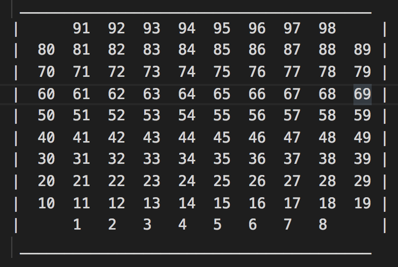
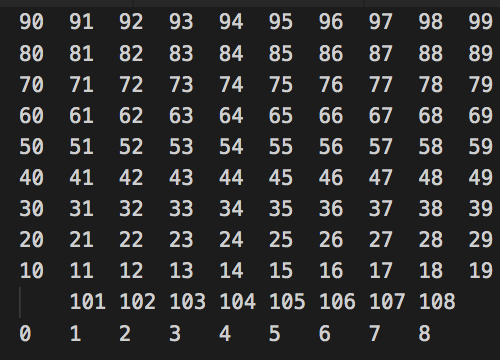
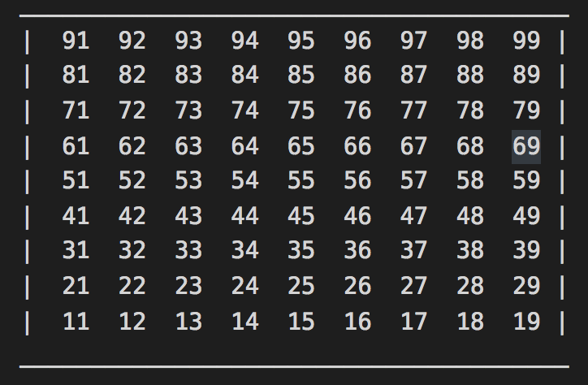

# r_cycle
### NewInControlEnvironment
---
**r_cycle** is a set of tools that enables users to easily integrate Novation MIDI controllers in their code through the Novation InControl protocol.
This allows for communication with the hardware in use, quick design of UI layouts and development of customised interactions for multimedia applications.
It is open source and freely available [here](https://github.com/Focusrite-Novation/r_cycle).

## Supported Hardware
* Launchpad MK2
* Launchpad Pro MK1
* Launchpad X
* Launchpad Mini MK3
* Launchpad Pro MK3

## Supported Environments / Programming Languages
* Pure Data


# How To Install - GLOBAL
The **r_cycle** folder must be placed in _Pd/externals_ or in a folder that is listed as part of the search path in Pd (to check in Pd go to: _Preferences->Path_).

**r_cycle** objects can then be accessed in the following ways:

  - adding **[declare -path r_cycle]** to the patch. **RECOMMENDED**
  - using the following syntax: r_cycle/name_of_the_object_ - ie **[r_cycle/COLORS]**. This is **NOT RECOMMENDED** because the length of the name of some objects could affect their graphical representation (ie _widgets_).


# How To Install - LOCAL
It is also possible to use **r_cycle** locally (ie make it only available to specific patches in a specific folder). 
In order to do that the user must place the r_cycle folder in the main folder where the patch lives and then use [declare -path r_cycle] to _import_ the library.

For example, assuming the user is working on a new patch called _mysequencer.pd_, that lives in the _myapp_ folder, in order to use **r_cycle** the user must:
  - place the r_cycle folder in the _myapp_ folder
  - use [declare -path r_cycle] in _mysequencer.pd_ 

This approach has the advantage of making the project easier to share (compared to the GLOBAL approach from above), since the user can share the folder _myapp_ without worrying about providing instructions about how to install r_cycle (see _How To Install - GLOBAL_).
The downside of having a _local_ version of **r_cycle** though, is that it is easy to end up with several copies of **r_cycle** in different places on the hard drive (to be noticed that **r_cycle** is less than 1 MB though - audio files excluded).


# List of objects
---
## Widgets
  - _doc_ **[LP_GUI]** The middle man between LP and Pd objects - required for adding objects to the surface of a LP and receiving messages from a LP
    * arg 1:        (float) LP_GUI_id - unique identifier
    * inlet 1:      
        - **[set _list_(** (NOT IN USE - SHOULD BE AVOIDED) set specific pad to a color - list of 3 floats: pad_id, color, status (0-1)
        - **[reset(** reset surface status
        - **[_HB_off(** turn off _heartbeat_
        - **[_buffers(** show the internal buffers  
        - **[device(** Launchpad device in use: *LP2*, *LP_Pro*, *LP_X*, *LPM_MK3*, *LP_Pro_MK3*
        - **[daw_mode *float*(** enables/disables *daw mode* on devices that support it  
        - **[programmer_mode *float*(** enables/disables *programmer mode* on devices that support it  

  - _doc_ **[DRUM_PADS]** needs **[LP_GUI]** - creates grids of drum pads on LP
    * arg 1:        (float) x-offset
    * arg 2:        (float) y-offset
    * arg 3:        (float) size of the square
    * arg 4:        (float) color (0-127)
    * arg 5:        (float) array mode - when _float_ is different from 0 pads are displayed sequentially (left-right bottom-top)
    * arg 6:        (float) LP_GUI_id
    * inlet 1:      
        - (bang) reset the object
        - **[map _list_(** map pads to specific numbers (generally MIDI notes) - ie for a 2x2 grid: **[map 10 20 11 21(** - pads are numbered from bottom-top left-right
        - **[reset_map(** use original pad indexing
        - **[color_bg _float_(** background color
        - **[color_fg _float_(** foreground color (ie selected pad)
        - **[print_args(** print to the console a list of all the arguments
    * outlet 1:     (float) pressed pad id
    * outlet 2:     (float) pad velocity
    * outlet 3:     (float) pad aftertouch  
    * outlet 3:     (float) pad polytouch  

  - _doc_ **[KEYBOARD]** needs **[LP_GUI]** - creates a chromatic keyboard on LP surface
    * arg 1:        (float) keyboard row (0-6 - bottom to top)
    * arg 2:        (float) pitch offset in semitones
    * arg 3:        (float) LP_GUI_id
    * inlet 1:      
        - (bang) reset the object
        - **[transpose _float_(** pitch offset in semitones
        - **[octave _float_(** octave offset
        - **[color_bg _float_(** background color
        - **[color_fg _float_(** foreground color (ie selected pad)
        - **[print_args(** print to the console a list of all the arguments
    * outlet 1:     (float) pressed pad id - MIDI note
    * outlet 2:     (float) pad velocity
    * outlet 3:     (float) pad aftertouch
    * outlet 3:     (list) 2 floats - pad polytouch  

  - _doc_ **[BUTTON]** needs **[LP_GUI]** - sets a pad to behave like a button (trigger)
    * arg 1:        (float) pad nr (on LP)
    * arg 2:        (float) color (0-127)
    * arg 3:        (symbol) symbol to output when pad is pressed
    * arg 4:        (float) LP_GUI_id
    * inlet 1:      
        - (bang) reset the object
        - **[color_bg _float_(** background color
        - **[color_fg _float_(** foreground color (ie selected pad)
        - **[toggle _float_(** toggle mode off/on
        - **[off_on _float_(** turn button off and on
        - **[print_args(** print to the console a list of all the arguments
    * outlet 1:     (symbol) symbol passed as argument
    * outlet 2:     (float) status: 0. released, 1. pressed  

  - _doc_ **[RADIO]** needs **[LP_GUI]** - sets pads/buttons to behave like a radio button / slider
    * arg 1:        (float) pad nr (on LP) - represents the starting point of the UI object
    * arg 2:        (float) length (1-8)
    * arg 3:        (float) ON color (0-127)
    * arg 4:        (float) OFF color (0-127)
    * arg 5:        (float) orientation - horizontal/vertical (0-1)
    * arg 6:        (float) LP_GUI_id
    * inlet 1:      
        - (bang) reset the object
        - **[color_bg _float_(** background color
        - **[color_fg _float_(** foreground color (ie selected pad)
        - **[select _float_(** allows to select value 
        - **[print_args(** print to the console a list of all the arguments
    * outlet 1:     (float) absolute value (0-1)
    * outlet 2:     (float) value ( 0-(length-1) )
    * outlet 3:     (float) status: 0. released, 1. pressed

  - _doc_ **[GRID]** needs **[LP_GUI]** - sets pads/buttons to behave like a 'sequence' (a programmable series of steps)
    * arg 1:        (float) pad nr (on LP) - represents the starting point of the UI object
    * arg 2:        (float) length (1-8)
    * arg 3:        (float) OFF color (0-127)
    * arg 4:        (float) LP_GUI_id
    * inlet 1:      
        - **[print_args(** print a list of all arguments in the Pd console
        - **[clear(** clear sequence
        - **[dump(** dump grid status from outlet 2
        - **[get_size(** return size of the grid - useful for [PATTERN]
        - **[steps __list__(** list of pairs of floats where 1st is the step (== x6 ticks) number and the 2nd is its value (==0 or !=0)
        - **[raw_ticks __list__(** list of ticks values - no tick number is needed (ie 1 0 1 0 would set tick 1 to 1, tick 2 to 0, tick 3 to 1 and tock 4 to 0) - mainly useful when dumping values out of [PATTERN]
        - **[pointer _float_(** expects a step nr to highlight it white
        - **[color_bg _float_(** background color
        - **[color_fg _float_(** foreground color (ie selected pad)
    * outlet 1:     (list) step nr + value, when value change
    * outlet 2:     (list) grid status, list of pairs: step nr + value

## Audio-MIDI
  - _doc_ **[TO_LPP]**
    * inlet 1:     
        - (float) pad/button nr - see HW layouts below
        - (list) pairs of elem_id+color
        - (symbol) button name 
        - **[clear(** clear the whole surface 
        - **[column _float_(** light up a specific column
        - **[row _float_(** light up a specific row
        - **[setall _float_(** set all the pad to a specific color
        - **[mode _float_(** 0.static, 1.flash, 2.pulse
        - **[mode _symbol_(** _static_, _flash_, _pulse_ 
        - **[text _symbol_ _float_ _float_(** text to print, loop (0-1), speed (1-7)
        - **[text_stop(** stop text scrolling
        - **[rgb _list_(** elem_id, R, G, B - this can be repeated up till 81 times in the same list - RGB in a range 0-63 
    * inlet 2:    (float) color

  - _doc_ **[FROM_LPP]** 
    * arg 1:        (float) MIDI channel (1-16)
    * arg 2:        (float) note/CC loopback (0-1) - visual feedback when pressing pads/buttons
    * arg 3:        (float) ON color (0-127)
    * inlet 1:      
        - (float) OFF/ON (0-1) - activate/deactivate the object
        - **[print_args(** print a list of all arguments in the Pd console
    * outlet 1:     (float) row (of a pressed pad/button)
    * outlet 2:     (float) column (of a pressed pad/button)
    * outlet 3:     (symbol) button name
    * outlet 4:     (float) note
    * outlet 5:     (float) velocity
    * outlet 6:     (list) polytouch - pair of floats: 1.pad nr, 2.value
    * outlet 7:     (float) aftertouch
    * outlet 8:     (float) cc value
    * outlet 9:     (float) cc number

  - _doc_ **[TO_LP2]**
    * inlet 1:     
        - (float) pad/button nr - see HW layouts below
        - (list) pairs of elem_id+color
        - (symbol) button name 
        - **[clear(** clear the whole surface 
        - **[column _float_(** light up a specific column
        - **[row _float_(** light up a specific row
        - **[setall _float_(** set all the pad to a specific color
        - **[mode _float_(** 0.static, 1.flash, 2.pulse
        - **[mode _symbol_(** _static_, _flash_, _pulse_ 
        - **[text _symbol_ _float_ _float_(** text to print, loop (0-1), speed (1-7)
        - **[text_stop(** stop text scrolling
        - **[rgb _list_(** elem_id, R, G, B - this can be repeated up till 81 times in the same list - RGB in a range 0-63 
    * inlet 2:    (float) color

  - _doc_ **[FROM_LP2]** 
    * arg 1:        (float) MIDI channel (1-16)
    * arg 2:        (float) note/CC loopback (0-1) - visual feedback when pressing pads/buttons
    * arg 3:        (float) ON color (0-127)
    * inlet 1:      
        - (float) OFF/ON (0-1) - activate/deactivate the object
        - **[print_args(** print a list of all arguments in the Pd console
    * outlet 1:     (float) row (of a pressed pad/button)
    * outlet 2:     (float) column (of a pressed pad/button)
    * outlet 3:     (symbol) button name
    * outlet 4:     (float) note
    * outlet 5:     (float) velocity
    * outlet 6:     (list) polytouch - pair of floats: 1.pad nr, 2.value
    * outlet 7:     (float) aftertouch
    * outlet 8:     (float) cc value
    * outlet 9:     (float) cc number
  
  - _doc_ **[TO_LPP3]** 
    * inlet 1:     
        - (float) pad/button nr - see HW layouts below
        - (list) pairs of elem_id+color
        - (symbol) button name 
        - **[clear(** clear the whole surface 
        - **[column _float_(** light up a specific column
        - **[row _float_(** light up a specific row
        - **[setall _float_(** set all the pad to a specific color
        - **[mode _float_(** 0.static, 1.flash, 2.pulse
        - **[mode _symbol_(** _static_, _flash_, _pulse_ 
        - **[text _symbol_ _float_ _float_(** text to print, loop (0-1), speed (0-127 - [2s complement](https://en.wikipedia.org/wiki/Two%27s_complement) - from 64 to 127 is reverse scrolling)
        - **[text_stop(** stop text scrolling
        - **[rgb _list_(** elem_id, R, G, B - this can be repeated up till 81 times in the same list - RGB in a range 0-127         
    * inlet 2:    (float) color
  
  - _doc_ **[FROM_LPP3]** 
    * arg 1:        (float) MIDI channel (1-16)
    * arg 2:        (float) note/CC loopback (0-1) - visual feedback when pressing pads/buttons
    * arg 3:        (float) ON color (0-127)
    * inlet 1:      
        - (float) OFF/ON (0-1) - activate/deactivate the object
        - **[print_args(** print a list of all arguments in the Pd console
    * outlet 1:     (float) row (of a pressed pad/button)
    * outlet 2:     (float) column (of a pressed pad/button)
    * outlet 3:     (symbol) button name
    * outlet 4:     (float) note
    * outlet 5:     (float) velocity
    * outlet 6:     (list) polytouch - pair of floats: 1.pad nr, 2.value
    * outlet 7:     (float) aftertouch
    * outlet 8:     (float) cc value
    * outlet 9:     (float) cc number

  - _doc_ **[TO_LP_X]** 
    * inlet 1:     
        - (float) pad/button nr - see HW layouts below
        - (list) pairs of elem_id+color
        - (symbol) button name 
        - **[clear(** clear the whole surface 
        - **[column _float_(** light up a specific column
        - **[row _float_(** light up a specific row
        - **[setall _float_(** set all the pad to a specific color
        - **[mode _float_(** 0.static, 1.flash, 2.pulse
        - **[mode _symbol_(** _static_, _flash_, _pulse_ 
        - **[text _symbol_ _float_ _float_(** text to print, loop (0-1), speed (0-127 - [2s complement](https://en.wikipedia.org/wiki/Two%27s_complement) - from 64 to 127 is reverse scrolling)
        - **[text_stop(** stop text scrolling
        - **[rgb _list_(** elem_id, R, G, B - this can be repeated up till 81 times in the same list - RGB in a range 0-127         
    * inlet 2:    (float) color
  
  - _doc_ **[FROM_LP_X]** 
    * arg 1:        (float) MIDI channel (1-16)
    * arg 2:        (float) note/CC loopback (0-1) - visual feedback when pressing pads/buttons
    * arg 3:        (float) ON color (0-127)
    * inlet 1:      
        - (float) OFF/ON (0-1) - activate/deactivate the object
        - **[print_args(** print a list of all arguments in the Pd console
    * outlet 1:     (float) row (of a pressed pad/button)
    * outlet 2:     (float) column (of a pressed pad/button)
    * outlet 3:     (symbol) button name
    * outlet 4:     (float) note
    * outlet 5:     (float) velocity
    * outlet 6:     (list) polytouch - pair of floats: 1.pad nr, 2.value
    * outlet 7:     (float) aftertouch
    * outlet 8:     (float) cc value
    * outlet 9:     (float) cc number

  - _doc_ **[TO_LPM_MK3]** 
    * inlet 1:     
        - (float) pad/button nr - see HW layouts below
        - (list) pairs of elem_id+color
        - (symbol) button name 
        - **[clear(** clear the whole surface 
        - **[column _float_(** light up a specific column
        - **[row _float_(** light up a specific row
        - **[setall _float_(** set all the pad to a specific color
        - **[mode _float_(** 0.static, 1.flash, 2.pulse
        - **[mode _symbol_(** _static_, _flash_, _pulse_ 
        - **[text _symbol_ _float_ _float_(** text to print, loop (0-1), speed (0-127 - [2s complement](https://en.wikipedia.org/wiki/Two%27s_complement) - from 64 to 127 is reverse scrolling)
        - **[text_stop(** stop text scrolling
        - **[rgb _list_(** elem_id, R, G, B - this can be repeated up till 81 times in the same list - RGB in a range 0-127 
    * inlet 2:    (float) color    

  - _doc_ **[FROM_LPM_MK3]** 
    * arg 1:        (float) MIDI channel (1-16)
    * arg 2:        (float) note/CC loopback (0-1) - visual feedback when pressing pads/buttons
    * arg 3:        (float) ON color (0-127)
    * inlet 1:      
        - (float) OFF/ON (0-1) - activate/deactivate the object
        - **[print_args(** print a list of all arguments in the Pd console
    * outlet 1:     (float) row (of a pressed pad/button)
    * outlet 2:     (float) column (of a pressed pad/button)
    * outlet 3:     (symbol) button name
    * outlet 4:     (float) note
    * outlet 5:     (float) velocity
    * outlet 6:     (float) cc value
    * outlet 7:     (float) cc number

  - _doc_ **[SIMPLE_PLAYER]** simple sample playback
    * arg 1:        (symbol) audio file
    * inlet 1:      
        - (bang) to play sample
        - **[load(** to select a file to load
        - **[read _symbol_(** to load a specific audio file
    * outlet 1:     audio signal - sample playback  

  - _doc_ **[MULTI_SAMPLER]** multi-sample player
    * arg 1:        (float) number of voices
    * inlet 1:      
        - (float) pad_id
        - **[load(** to select a file to load
        - **[read _float_ _text_(** to load a specific audio file (ie [read 2 ../audio/kick.wav( where the _float_ is the voice nr and the text the file to load )
    * inlet 2:    (float) velocity
    * outlet 1:     audio signal - sample playback (all samples)  

  - _doc_ **[MONO_MIDI]** ignore note off messages in case don't come from last pressed key
    * inlet 1:      (float) note on/off
    * inlet 2:      (float) velocity
    * outlet 1:     (float) note on/off
    * outlet 2:     (float) velocity  

  - _doc_ **[OSCILLOSCOPE]** digital scope with zoom functions - useful for displaying audio signals  

  - _doc_ **[BAND_LIMITED]** band-limited mono synth (sine/triangle/sawtooth/square)
    * inlet 1:      (float) MIDI note (internally clipped to 106 for aliasing reasons)
    * inlet 2:      (float) volume (0-1)
    * inlet 3:      (float) waveform (0-3)
    * outlet 1:     audio signal  

  - _doc_ **[TAPE_DELAY]** interpolated feedback delay - time parameter is interpolated to emulate the tape effect
    * inlet 1:      audio signal to delay
    * inlet 2:      
        - **[time _float_(** delay time in msec (0-1000)
        - **[feedback _float_(** delay feedback (0-1)
        - **[dry_wet _float_(** dry/wet (0-1)

  - _doc_ **[G_SYNTH]** 4 grains granular module
    * inlet 1:      
        - **[glissando __float__(** set glissando in msec (0-10000)
        - **[pitch __float__(** set pitch (0-1) (this is the ratio - ie 1 is original pitch, 0.5 one octave down, 2 one octave up)
        - **[spray __float__(** set spray (0-1) - distribution of single grains in the stereo field
        - **[offset __float__(** set offset (0-1) - reading point in the audio buffer
        - **[volume __float__(** set volume (0-1)   
        - **[reset_phase(** reset internal phasors  
        - **[read __text__(** audio file to read (ie [read ../audio/my_sample.wav( )
    * outlet 1:     left audio signal
    * outlet 2:     right audio signal  

  - _doc_ **[WAVESHAPER]** simple distortion using transfer functions
    * inlet 1:      audio signal
    * inlet 2:      
        - **[mix __float__(** wet-dry parameter (0-1)
        - **[gain __float__(** audio input gain (default 1)
        - **[function __float__(** waveshaper function (0-6) - 0 LINEAR - 1 POWER FUNCTION - 2 EXPONENTIAL FUNCTION - 3 CHEBYCHEV_2 - 4 CHEBYCHEV_3 - 5 CHEBYCHEV_4 - 6 CHEBYCHEV_5
    * outlet 1:     audio signal
  
  - _doc_ **[ENVELOPE]** simple attack/release envelope - outputs an audio signal
    * inlet 1:      
        - (float) when ==0 output signal goes from 1 to 0 in 'release' time, when !=0 output signal goes from 0 to 1 in 'attack' time
        - **[attack _float_(** attack time in msec
        - **[release _float_(** release time in msec
    * outlet 1:     audio signal - envelope 

## Misc
  - _doc_ **[QUERY]** queries al r_cycle objects
    * outlet 1:     return print_inlets, print_outlets, print_args and print_methods in accord with the button pressed 

  - _doc_ **[BPM2MS]** converts from bpm to milliseconds and the other way around
    * inlet 1:      (float) number to convert
    * outlet 1:     (float) number converted

  - _doc_ **[DEVICE_SELECT]** opens dialog window to select AUDIO/MIDI device inputs and outputs

  - _doc_ **[SQUARE]** generates squares to send to **[LP_GUI]**
    * inlet 1:      (list) starting point on LP (bottom-left corner) + square size in nr of pads
    * inlet 2:      (float) color (0-127)
    * outlet 1:     (list) pairs of pads (id) + colors

  - _doc_ **[COLORS]** preview 128 LP colors and return color values
    * outlet 1-2-3: (float) R G B values (0-255)
    * outlet 4:     (float) color representation for Pd GUI objects

  - _doc_ **[COLORS_NO_GUI]** same as **[COLORS]** but without visual feedback (no graph-on-parent)
    * outlet 1-2-3: (float) R G B values (0-255)
    * outlet 4:     (float) color representation for Pd GUI objects

  - _doc_ **[DSP_TOGGLE]** turns on/off Pure Data DSP (audio on/off)
    * inlet 1:      (float) off/on (0-1)

  - _doc_ **[INC_DEC]** increment/decrement number
    * inlet 1:      (bang) to increment
    * inlet 2:      (bang) to decrement
    * inlet 3:      (float) set next number
    * outlet 1:     (float) number

  - _doc_ **[EU_R]** quasi-euclidean generator
    * inlet 1:      
        - **[print(** print sequence to console
        - **[length _float_(** sequence length (0-16)
        - **[ones _float_(** number of onsets in the sequence (0-length)
        - **[offset _float_(** sequence offset (0-length)
        - **[get _float_(** return value of the selected step (0-1) - this is generally used to read the sequence
    * outlet 1:     (float) value (0-1) of the requested step (see _get $1_ above )

  - _doc_ **[PRINT_2]** allows to visualize text in the patch instead of on the console
    * inlet 1:      can be everything - float, symbol, etc.
                    **[_clean(** to clean the text

  - _doc_ **[REPEAT]** repeats a floating point value an _n_ number of times every _t_ msec
    * inlet 1:      
          - *float* to be repeated
          - list to be repeated (circular buffer)
          - **[print_args(** print all arguments to the console
          - **[msec $1(** repetition rate in msec
          - **[repeat(** number of repetitions (>0) - if <1 it would still generate 1 output
          - **[stop(** immediately stop repetitions
    * outlet 1:     (float) value == input

  - _doc_ **[CLOCK]** sequencer clock with transport and (optional) MIDI out - MIDI based with 96 ticks per bar
    * arg 1:        (float) unique identifier
    * inlet 1:      
         - **[play(** send 'play' msg and start clock
         - **[stop(** send 'stop' msg and stop clock
         - **[continue(** send 'continue' msg and stop clock
         - **[midi _float_(** enable/disable MIDI output (0-1)
         - **[bpm _float_(** set bpm
    * outlet 1:     (bang) outputs a 'bang' per tick
    * outlet 2:     (symbol) outputs 'play/stop/continue' in accord with the CLOCK status

  - _doc_ **[PATTERN]** monophonic pattern - needs to be linked to a [CLOCK]
    * arg 1:        (float) unique identifier of the [CLOCK] [PATTERN] is linked to 
    * inlet 1:      
        - **[size _float_(** size of the sequence in steps (1/16th)
        - **[clear(** clear sequence
        - **[direction _float_(** 0: normal, 1: reverse
        - **[set _float_ _float_(** set values in ticks (ie [0 1, 24 20( - sets tick 0 to 1 and tick 24 to 20)
        - **[step _float_ _float_(** set values in steps (ie [0 5, 14 35( - sets step 0 to 5 and step 14 to 35)
        - **[steps _list_(** list of pairs of floats where 1st is the step (== x6 ticks) number and the 2nd is the value (==0 or !=0)
        - **[sync_rate _float_(** integer in a range 0-11, corresponding to the following sync rates: 1, 1T, 2, 2T, 4, 4T, 8, 8T, 16, 16T, 32, 32T
     * outlet 1:     (float) outputs the current step nr
     * outlet 2:     (bang) outputs a 'bang' per tick
     * outlet 3:     (float) outputs the value of the current tick
     * outlet 4:     (list) outputs a list of pairs of floats, where the 1st is the ID and the 2nd its value

  - _doc_ **[PROBE]** display audio signal value
    * inlet 1:        audio signal

## Guidelines
Here are some **r_cycle** _standards_, also useful to better understand the overall architecture.
Respecting these standards makes our lives easier :) 
  - [send] and [return] names always have a the following form: $0_name, unless they need to be GLOBAL

  - When Pd GUI objects (ie [bng], [vradio], etc.) use internal sends and returns (right-click->Properties), these always use names with the following structure (unless they need to be GLOBAL):
    * SEND:   $0_from_g_name
    * RETURN: $0_to_g_name
    where __g__ stands for GUI. This makes easier interacting with them.
  
  - Try to avoid to use [s~] and [r~] (it's fine for control signals)

  - comments, comments, comments, comments, comments, ... use as many comments as you can, let other people understand what's going on in your head!

  - we normally use 2 numeric ranges and do the __scaling__ inside the various objects:
    * (int) with range 0-127 - MIDI (to be noted that in Pd all numbers are floats)
    * (float) with range 0-1
    basically when it's not MIDI is better to have a __standard__ so that it's easier to connect different objects without worrying about having to scale numbers

  - __abstractions__ and __subpatches__ respect the right-to-left order of operations

  - all r_cycle objects must have a __print_args__ method, so all arguments specific to an object can be printed in the console when a [print_args( message is received(

  - all r_cycle objects must have a __print_methods__ method, so all methods specific to an object can be printed in the console when a [print_methods( message is received

  - all r_cycle objects must have a __print_outlets__ method, so the function of all outlets of an object can be printed in the console when a [print_outlets( message is received

  - always use [trigger], don't connect 1 outlet to multiple inlets without using this object. It's important for readibility and debugging

  - place all audio files in the _audio_ folder

  - abstractions that use visible native Pd GUI objects with labels (via graph-on-parent), must use methods that match the labelling (ie the method to control a slider labelled 'freq' must be [freq $1( )

  - methods (ie [_methodname_ $1( ) must be sent to the leftmost inlet. The only exception is audio objects in which the rightmost inlet is used

  - all object descriptions in README.md must use the keyword *\_doc_* in order to be found by [LP_GUI]'s *print_objects* method 

  - all the subpatches must have all the [inlet]s visible at the top of the patch and all the [outlet]s visible at the bottom of the patch

## Compatibility
  - Pure Data >=0.50 

# Hardware Layout - LP Pro
Pad/Button IDs in decimal


# Hardware Layout - LP Pro MK3
Pad/Button IDs in decimal


# Hardware Layout - LP Mini MK3 / X
Pad/Button IDs in decimal


# Pure Data SDK
---
## Architecture Overview
**[LP_GUI]** is the core object used to talk to the hardware. It is the only object that has knowledge of the hardware and talks with it directly. It is possible to use multiple **[LP_GUI]** objects simultaneously by setting a unique identifier as an argument.
Objects like **[KEYBOARD]** and **[DRUM_PADS]** are widgets that allow the hardware to interact with Pure Data (ie **[KEYBOARD]** could control a synth).
These are also in charge of generating visual feedback on the hardware. When MIDI events are received **[LP_GUI]** talks to the right object which decides what to do with that info and lets **[LP_GUI]** know (ie pressing a specific pad lights up the whole surface)

## Widget Architecture
Widgets must reply to **[LP_GUI]** _heartbeat_ with their _obj_unique_id_ - **[list obj_$0]**

Widgets must only communicate their attributes once, when requested by **[LP_GUI]** (this means objects shouldn't send anything to **[LP_GUI]** when created - ie using **[loadbang]** - see **[KEYBOARD]** and **[DRUM_PADS]**)

In all the objects the real-time processing happens in **[pd PROCESSING]**
* here the object receives info from **[LP_GUI]** when a pad/button is pressed on the HW in the form of a list: _elem_id_, _color_, _status_ plus special messages: [velocity $1(, [polytouch $1 $2( and [aftertouch $1( - these are sent prior to the list
* the object must reply with a list of: _elem_id_, _color_. This allows to create custom animations (ie pressing 1 pad makes the whole surface pulse for 1 sec)
* Objects must have a _print_args_ method that prints a list of all the arguments for the object in the console 
* Objects must have a _print_methods_ method that prints a list of all the methods for the object in the console 
* Objects must have a _print_outlets_ method that prints a list of the functions of all outlets of the object in the console 

## Communication Protocol - LP_GUI <-> Widgets

The communication between **[LP_GUI]** (the hub) and the widgets is bi-directional.

**[LP_GUI]** talks to the objects in the following ways:
* sends a _heartbeat_ to all the objects to check they are alive
* initialize the objects to get all their attributes (only once)
* when receiving MIDI from hardware, sends values to the widgets in the form of a list containing: _elem_id_ (pads/buttons), color, status (pressed/released) plus special messages: [velocity $1(, [polytouch $1 $2( (**aftertouch** is a global send [s _aftetouch] since it cannot be associated to a specific pad)- these are sent before the list

All widgets report the info associated to them in a form of a list containing first the _obj_unique_id_ (symbol/string) the 1 or more pairs of integers representing _elem_id_ (pads/buttons) and color.

All widgets, when receiving values from **[LP_GUI]** (ie because a button has been pressed on the hardware) and performing necessary processing, send a list of integers containing: _elem_id_ and _color_ back to **[LP_GUI]**.


## Useful Links
* [r_cycle](https://github.com/Focusrite-Novation/r_cycle)
* [Launchpad MK2 Programmer's Reference Guide](https://customer.novationmusic.com/sites/customer/files/novation/downloads/10529/launchpad-mk2-programmers-reference-guide-v1-02.pdf)
* [Launchpad Pro Programmer's Reference Guide](https://d2xhy469pqj8rc.cloudfront.net/sites/default/files/novation/downloads/10598/launchpad-pro-programmers-reference-guide_0.pdf)
* [Launchpad X Programmer's Reference Guide](https://customer.novationmusic.com/sites/customer/files/downloads/Launchpad%20X%20-%20Programmers%20Reference%20Manual.pdf)
* [Launchpad Mini MK3 Programmer's Reference Guide](https://customer.novationmusic.com/sites/customer/files/downloads/Launchpad%20Mini%20-%20Programmers%20Reference%20Manual.pdf)
* [Novation Components](https://components.novationmusic.com/)
* [Pure Data](https://github.com/pure-data/pure-data)

## Copyright
Except as otherwise noted:

```
Novation r_cycle
Copyright 2019-2020 Focusrite Audio Engineering Limited

This product includes software developed at
Focusrite Audio Engineering Limited (https://focusrite.com/).

```

## License
see [LICENSE](./LICENSE)
